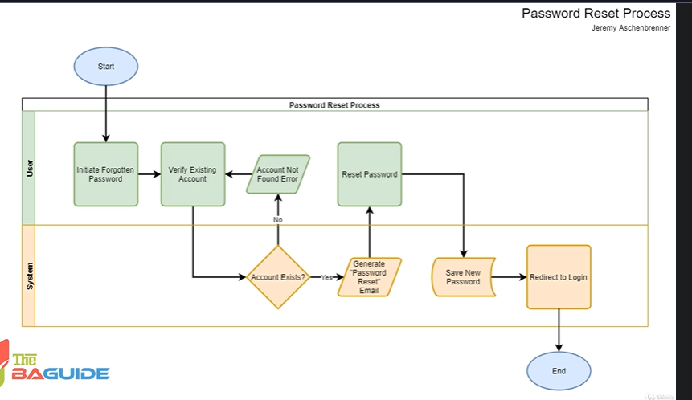

# Course KickOff

```txt
Processes are everywhere.
Businesses and organizations of all sizes have processes to complete various tasks.  
Process flow charts are the way to take that process and make it visually understandable and recognizable.
```

```txt
A process is a series of steps
that are taken to complete a task.
These are utilized by you thousands of times a day,
whether you know it or not.
You are following specific processes
to complete everyday tasks in your personal life
as well as your normal tasks in your business career.
Things such as getting out of bed,
making a pot of coffee, pulling the car out of the driveway,
creating that monthly report for your boss,
or completing that transaction at work.
```



## The End Goal

```txt
let's talk about why you would create a process flow chart.
There definitely is no need
to go create a process flow chart
for every process that you handle
or you deal with in a daily basis.
There's no need, it would be a waste of time.
So what are the key reasons
you would create a process flow chart?
```

1. **Documentation**

```txt
If you're working for a business
and you complete a specific process for a task,
that business may want you to document that process
so it can be repeated.
That documentation can be handed out to new trainees
or to other people that handle that same process
so they can follow the same tasks that you do,
and it creates some consistency within that process.
```

2. **Visualization**

```txt
It's a lot easier for somebody
to digest and understand a process
if they can see it visually.
The age-old saying is, "A picture's worth a thousand words."
And that comes true a lot when you're creating diagrams.
The diagrams make it less scary for somebody
to be introduced to it,
and to work through that specific process.
```

3. **Identify gaps and inefficiencies** in the process

```txt
A lot of times when you're completing the process, you don't really think about,
"Hey, how could this be done better or easier?
What are our pain points?
What are the areas that take longer than they should?

What steps could we potentially eliminate?"
When you document that process
and you put it into a process flow chart,
those gaps and inefficiencies usually just jump off the page.

They make themselves known right away
without even much analysis being done.
```