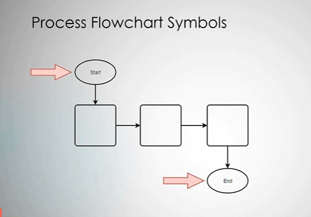
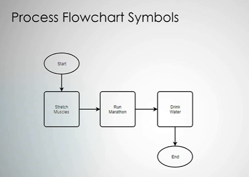
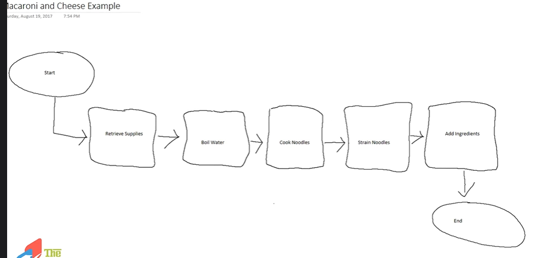

# Breaking Down the Process Flowchart - The Basics

## Start and End Symbols



* Don't use arrows cross over each other
* Don't use curved arrows.
  * Use staright line arrows

* Process tasks are represented by squares or rectangles,

```txt
For process tasks, there is text that is put inside of them that helps describe that something, or that action that's being taken within them, and the general rule of thumb
is the text is a verb and a noun.
```

```txt
The rule of thumb is a verb and a noun.
It's okay if you can't fit it into two words.
Do what's gonna make sense.

The big thing is you don't wanna have a big sentence, and you don't need to have a whole bunch of description in there.
```

**Process Task Verbs**  

As it sometimes can be difficult to come up with the right verb for various processes, here is a list you can use to spark some ideas.

• acquire  
• add  
• adjudicate  
• assess  
• calculate  
• cancel  
• change  
• check  
• conduct  
• control  
• create  
• delete  
• determine  
• identify  
• maintain  
• manage  
• merge  
• modify  
• obtain  
• plan  
• query  
• record  
• receive  
• request  
• remove  
• report  
• reject  
• review  
• roll back  
• select  
• specify  
• submit  
• update  
• validate  
• verify  

```txt
As you create process flow charts,
you want to make sure that they're simple,
they're clean, and they're clear.
I know they can be really boring to look at,
and you want to make them more elegant, but don't.
Boring is simple and boring is easy to understand.
```



## Macaroni and Cheese Example

