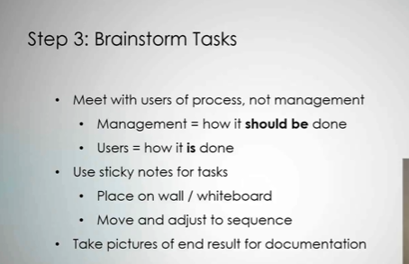
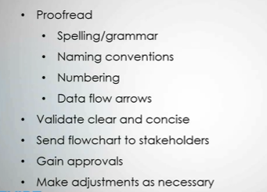

# 7 Steps to Create a Process Flowchart

1. Understand end goal

> Documentation  
> Visualization  
> Identify gaps and ineffiencies  

2. Determine scope

```txt
You wanna know where that process starts and ends
because yes, of course, there's steps prior to that,
but you wanna make sure you stay within the scope
of what you're trying to define.
What is your end goal?
What are you trying to document?
What are you trying to visualize?
Or where are you trying to identify gaps or inefficiencies?
And make sure you have that clearly defined.
Otherwise this task of documenting the process
or putting this process flow chart together
is gonna be never-ending,
'cause you're gonna constantly be creeping into
other processes and other areas.
So it's really important to make sure
that you've fully defined and understood the scope
of the process that you want to document
within a process flow chart.
```

3. Brainstorm tasks



4. Identify owners

> Walk through each task  
> Cross-check with users to validate ownership  
> Take note of owners not included in meetings  

5. Arrange into sequence

* Put each step into sequence
  * Don't be afraid of making mistakes
* Be mindful of scope
  * Input and outputs from other processes just need to be identified, not detailed

6. Document into flowchart


* Utilize notes and pictures
* Tool used is not important
  * Draw.io
  * Microsoft Visio
  * Microsoft Excel

```txt
A lot of newer business analysts,
and hell, even some senior business analysts
will try to do this right away.
They'll skip kind of the first five steps,
or kinda brush over them,
and start trying to put it into a tool right away.
Don't do it.
The tools are pretty nice to you use, the Draw.io to Visio.
I mean, they're great tools to use,
and they're they're user friendly,
but I'm gonna tell you, you're gonna waste a ton of time
formatting, reformatting, revamping, changing.
Just don't worry about putting it in the tool
until you have it defined.
You put it in the tool when you're about 90% done,
when you've got at 90% documented,
```

7. Review with others




